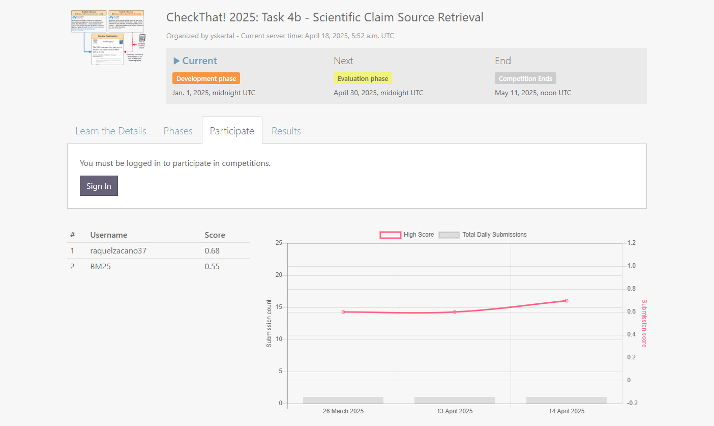
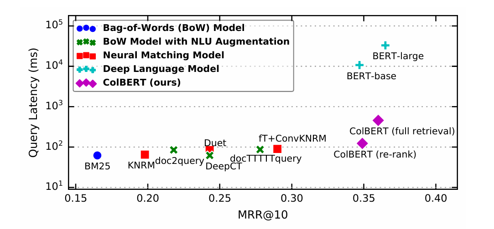

# CheckThat! 2025 Task 4B: Scientific Claim Source Retrieval

This repository contains implementations of three different retrieval approaches for CheckThat! 2025 Task 4B: Scientific Claim Source Retrieval.

## Task Description

The CheckThat! 2025 Task 4B focuses on retrieving scientific papers mentioned in tweets. Given a tweet that mentions a scientific paper without providing a URL, the task is to retrieve the mentioned paper from a pool of candidate papers from the CORD-19 dataset.

The task is evaluated using Mean Reciprocal Rank (MRR@5) and is part of the [CLEF 2025 CheckThat! Lab](https://checkthat.gitlab.io/clef2025/task4/).



## Performance Results

| Model                     | MRR@1    | MRR@5    | MRR@10   | Improvement over BM25 |
|---------------------------|----------|----------|----------|----------------------|
| BM25 Baseline             | 0.5079   | 0.5511   | 0.5561   | -                    |
| DocT5Query                | 0.5224   | 0.5629   | 0.5679   | +2.14%               |
| ColBERT v2                | 0.5857   | 0.6354   | 0.6354   | +15.10%              |
| OpenAI Embedding          | 0.6136   | 0.6767   | 0.6767   | +22.84%              |

OpenAI Embedding outperforms all other approaches, with a 22.84% improvement over the BM25 baseline on MRR@5.

## Approaches Overview

### 1. DocT5Query (Document Expansion)

DocT5Query is a document expansion technique that leverages the T5 language model to enhance information retrieval by generating potential queries that might lead to a document, then adding these queries to the document representation before indexing.

- **Advantages**: Zero-code enhancement to existing BM25, addresses vocabulary gap
- **Model**: T5-base from Hugging Face Transformers
- **Performance**: 2.14% improvement over BM25 baseline on MRR@5

### 2. ColBERT v2 (Late Interaction)

ColBERTv2 revolutionizes retrieval through its "late interaction" architecture, which outperforms both traditional term-frequency methods and dense retrieval models by preserving both lexical matching and semantic understanding.

- **Advantages**: Preserves term-level information, contextual understanding
- **Model**: colbert-ir/colbertv2.0
- **Performance**: 15.10% improvement over BM25 baseline on MRR@5

### 3. OpenAI Embedding (Dense Retrieval)

This approach leverages OpenAI's pre-trained text embedding models to generate dense vector representations of both papers and tweets, capturing semantic meaning beyond simple keyword matching.

- **Advantages**: Semantic understanding, contextual awareness, zero-shot capability
- **Model**: OpenAI text-embedding-3-small
- **Performance**: 22.84% improvement over BM25 baseline on MRR@5

## Information Retrieval Model Comparison

The impressive performance of the OpenAI embedding approach can be understood in the context of the evolution of information retrieval models:


*Image Source: [ColBERT: Efficient and Effective Passage Search via Contextualized Late Interaction over BERT](https://dl.acm.org/doi/pdf/10.1145/3397271.3401075)*

OpenAI embeddings excel for several reasons:
1. **Superior pre-training**: Trained on diverse, high-quality data
2. **Contextual understanding**: Better grasp of scientific language and concepts
3. **Zero-shot capabilities**: No fine-tuning required
4. **Optimized vector dimensions**: Efficient representation of semantic information

## Repository Structure

```
CheckThat-Task4B-ColBERT/
├── check_dataset.py                # Dataset inspection utilities
├── .gitignore                      # Git ignore file
├── img1_IR_models.png              # Information retrieval models comparison
├── img2_Participation.png          # Competition participation screenshot
├── m1_doct5query/                  # DocT5Query approach
│   ├── doc_t5_query.md             # Implementation details and results
│   ├── doc_t5_query.py             # Implementation code
│   ├── predictions/                # Prediction results
│   ├── requirements.txt            # Python dependencies
│   └── subtask4b_query_tweets.tsv  # Query dataset
├── m2_colbertv2/                   # ColBERT v2 approach
│   ├── CheckThat-Task4B-ColBERT-Summary.md # Project summary
│   ├── colbert_predictions.tsv     # ColBERT predictions
│   ├── colbert_retriever_optimized.py # Optimized implementation
│   ├── colbert_technical_report.md # Technical details and results
│   ├── predictions.tsv             # Prediction results
│   ├── requirements.txt            # Python dependencies
│   ├── run_colbert.sh              # Shell script to run implementation
│   ├── test_colbert.py             # Testing utilities
│   └── wsl_setup_guide.md          # Guide for setting up WSL
├── m3_openai_embedding/            # OpenAI embedding approach
│   ├── openai_embedding.py         # Implementation code
│   ├── openai_embedding_method.md  # Implementation details and results
│   ├── predictions.tsv             # Prediction results
│   ├── requirements.txt            # Python dependencies
│   └── subtask4b_collection_data.pkl # Collection dataset
├── README.md                       # This file
└── subtask_4b/                     # Task dataset directory
    ├── getting_started_subtask4b.ipynb # Notebook with starter code
    ├── README.md                   # Dataset description
    └── subtask4b_collection_data.pkl # Paper collection (CORD-19 subset)
```

## Running the Implementations

### Prerequisites

- Python 3.9+
- For ColBERT: Windows Subsystem for Linux (WSL2) with Ubuntu 22.04
- For OpenAI: OpenAI API key

### Setup for each approach

1. **DocT5Query**:
```bash
cd m1_doct5query
pip install -r requirements.txt
python doc_t5_query.py
```

2. **ColBERT v2** (requires WSL, see m2_colbertv2/wsl_setup_guide.md):
```bash
cd m2_colbertv2
pip install -r requirements.txt
chmod +x run_colbert.sh
./run_colbert.sh
```

3. **OpenAI Embedding**:
```bash
cd m3_openai_embedding
pip install -r requirements.txt
# Set your OpenAI API key
export OPENAI_API_KEY="your-api-key-here"
python openai_embedding.py
```

## Project Tracking

This project is tracked using Weights & Biases. Detailed metrics, model performance, and experiment tracking can be found at:

[https://wandb.ai/raquelzacano37-university-of-british-columbia/scientific-web-discourse](https://wandb.ai/raquelzacano37-university-of-british-columbia/scientific-web-discourse)

## Citations

If you use these implementations in your research, please cite:

```
@inproceedings{khattab2020colbert,
  title={ColBERT: Efficient and Effective Passage Search via Contextualized Late Interaction over BERT},
  author={Khattab, Omar and Zaharia, Matei},
  booktitle={Proceedings of the 43rd International ACM SIGIR Conference on Research and Development in Information Retrieval},
  year={2020}
}

@article{nogueira2019doc2query,
  title={Document Expansion by Query Prediction},
  author={Nogueira, Rodrigo and Yang, Wei and Cho, Kyunghyun and Lin, Jimmy},
  journal={arXiv preprint arXiv:1904.08375},
  year={2019}
}

@misc{openai2022embedding,
  title={OpenAI API},
  author={OpenAI},
  year={2022},
  howpublished={\url{https://openai.com/blog/introducing-text-and-code-embeddings}}
}
``` 