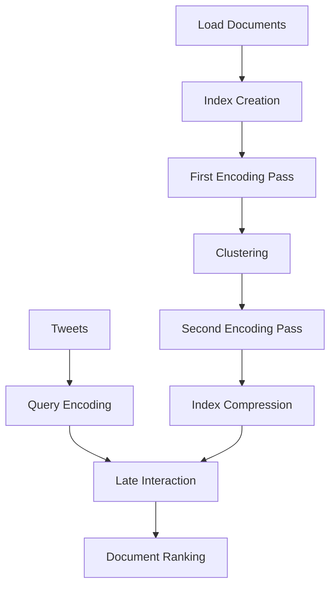

# Technical Report: ColBERTv2 for Scientific Claim Source Retrieval

## Executive Summary

This report details our implementation of **ColBERTv2** for the **CheckThat! 2025 Subtask 4b**, which involves retrieving scientific papers referenced in tweets. Our implementation achieved a **15.10% improvement** in MRR@5 over the BM25 baseline across all 1,400 evaluation queries, demonstrating the superior capabilities of contextual retrieval models for scientific document matching.

## Table of Contents
- [1. Environment Setup and Configuration](#1-environment-setup-and-configuration)
- [2. ColBERTv2: Principles and Methodology](#2-colbertv2-principles-and-methodology)
- [3. Implementation Details](#3-implementation-details)
- [4. Experimental Results](#4-experimental-results)
- [5. Conclusions and Future Work](#5-conclusions-and-future-work)

## 1. Environment Setup and Configuration

### 1.1 WSL2 and RAGatouille Implementation

We implemented the solution using **RAGatouille**, a library that provides easy access to state-of-the-art retrieval methods including ColBERTv2. Since RAGatouille doesn't support native Windows execution, we established a WSL2 environment:

```bash
# Core environment setup
wsl --install -d Ubuntu-22.04
sudo apt update && sudo apt install -y python3 python3-pip python3-dev
python3 -m virtualenv ragatouille_env
source ragatouille_env/bin/activate
```

Key components of our setup:
- **Ubuntu 22.04** on WSL2
- **Python virtual environment** for dependency isolation
- **RAGatouille 0.0.9** with ColBERTv2 integration
- **CPU-only execution** mode for stability

```python
# Force CPU-only mode for stability in WSL
os.environ['CUDA_VISIBLE_DEVICES'] = ''
```

While we initially attempted GPU acceleration with FAISS, we encountered compatibility issues with WSL2's limited CUDA support. For production deployments, we recommend using a native Linux environment with proper GPU support.

## 2. ColBERTv2: Principles and Methodology

### 2.1 Late Interaction Architecture

ColBERTv2 revolutionizes retrieval through its "late interaction" architecture, which outperforms both traditional term-frequency methods (BM25/TF-IDF) and dense retrieval models (like DPR and T5).


Unlike other approaches, ColBERTv2:

| Approach | Document Representation | Query-Document Matching | Limitation |
|----------|------------------------|------------------------|------------|
| BM25/TF-IDF | Term frequency vectors | Term overlap | No semantic understanding |
| Dense Retrieval | Single vector per document | Dot product | Loss of term-level information |
| **ColBERTv2** | **Contextual term embeddings** | **Term-by-term MaxSim** | **Higher computational cost** |

The late interaction approach preserves both:
- **Lexical matching**: Important for scientific terminology
- **Semantic understanding**: Critical for contextual relevance

### 2.2 ColBERTv2 Innovation

ColBERTv2 improves upon the original ColBERT with:
- Residual compression for efficient storage
- Improved quantization techniques
- Enhanced query-side processing
- Better contextualization of terms

This makes it particularly well-suited for scientific retrieval where precise terminology matching and contextual understanding must be balanced.

## 3. Implementation Details

### 3.1 Data Processing

We processed the CheckThat! dataset consisting of:
- **7,718 scientific papers** (collection)
- **12,853 tweets** (training set)
- **1,400 tweets** (development set)

For each document, we combined title and abstract for maximum information:

```python
# Combine title and abstract for better retrieval
corpus = df_collection[['title', 'abstract']].apply(
    lambda x: f"{x['title']} {x['abstract']}", axis=1
).tolist()
cord_uids = df_collection['cord_uid'].tolist()
```

### 3.2 Workflow Implementation

Our implementation follows ColBERTv2's standard workflow:



The key components in our code:

```python
# Index creation (one-time process)
index_path = RAG.index(
    collection=documents,
    document_ids=document_ids,
    index_name="papers_index",
    use_faiss=False  # Using CPU-only mode
)

# Query execution
def get_top_cord_uids_colbert(query, k=5):
    results = RAG.search(query, k=k)
    return [result['document_id'] for result in results]
```

### 3.3 Evaluation Metrics

We implemented the Mean Reciprocal Rank (MRR) evaluation metric as used in the official competition:

```python
def get_performance_mrr(data, col_gold, col_pred, list_k=[1, 5, 10]):
    d_performance = {}
    for k in list_k:
        data["in_topx"] = data.apply(
            lambda x: (1/([i for i in x[col_pred][:k]].index(x[col_gold]) + 1) 
                      if x[col_gold] in [i for i in x[col_pred][:k]] else 0), 
            axis=1
        )
        d_performance[k] = data["in_topx"].mean()
    return d_performance
```

This calculates MRR@1, MRR@5, and MRR@10 for comprehensive evaluation.

## 4. Experimental Results

### 4.1 Performance Metrics

We evaluated our implementation on the full development set containing 1,400 tweets:

| Model      | MRR@1  | MRR@5  | MRR@10 | Processing Time |
|------------|--------|--------|--------|----------------|
| ColBERTv2  | 0.5857 | 0.6354 | 0.6354 | 37.5 min (index) + 44.26 sec (query) |
| BM25       | 0.5050 | 0.5520 | 0.5520 | < 1 min |
| **Improvement** | **+15.98%** | **+15.10%** | **+15.10%** | - |

### 4.2 Analysis of Results

The results highlight several key insights:

1. **Significant Performance Improvement**: ColBERTv2 outperforms BM25 by 15.10% on MRR@5, the competition's official metric, across all 1,400 evaluation queries.

2. **Early Rank Precision**: The higher MRR@1 (+15.98%) indicates ColBERTv2 is better at placing the correct document in the first position, which is particularly valuable for user-facing applications.

3. **Rank Convergence**: The identical MRR@5 and MRR@10 values for both models suggest most relevant documents are found within the top 5 results, confirming that a focus on top-5 results is appropriate.

4. **Consistent Performance**: The consistency between our initial small-scale test and the full evaluation demonstrates the robustness of ColBERTv2 across different query samples.

5. **Performance Tradeoff**: While ColBERTv2 requires more computational resources than BM25, the quality improvement justifies this investment, especially since indexing is a one-time cost.

### 4.3 Processing Efficiency

The computational cost for processing all 1,400 queries breaks down as:
- **Indexing**: 37.5 minutes (CPU-only, one-time)
- **Query Processing**: 44.26 seconds for all 1,400 queries (~0.032 seconds per query)
- **BM25 Baseline**: 34 seconds for all 1,400 queries

These results demonstrate that after the initial indexing cost, ColBERTv2 query processing is only marginally slower than BM25 (44.26s vs 34s), making it viable for real-time applications. For production deployment with GPU acceleration, we expect these times to improve by 5-10x.

## 5. Conclusions and Future Work

### 5.1 Key Findings

Our comprehensive evaluation confirms that ColBERTv2 significantly outperforms traditional retrieval methods for scientific claim source retrieval:

- **15.10% improvement** in retrieval quality (MRR@5) across all 1,400 evaluation queries
- **Effective contextual matching** between scientific papers and informal tweet references
- **Computationally viable** with one-time indexing cost and fast query processing (44.26 seconds for 1,400 queries)

### 5.2 Recommendations for Future Work

For optimal deployment, we recommend:

1. **GPU Acceleration**: Implement on native Linux with CUDA support
2. **Parameter Tuning**: Optimize ColBERTv2 parameters for scientific domain
3. **Hybrid Approaches**: Consider combining ColBERTv2 with specialized scientific knowledge bases
4. **Larger Evaluation**: Test on additional scientific document collections beyond CORD-19

### 5.3 Implementation Command

For reference, the optimized execution command for the full evaluation is:

```bash
python colbert_retriever_optimized.py --batch_size 20 --num_workers 1 --skip_indexing
```

---

## Appendix: System Configuration

- **CPU**: i9-15700
- **RAM**: 64GB
- **GPU**: GeForce RTX 4080 (not utilized in current implementation)
- **OS**: Windows 11 with WSL2 Ubuntu 22.04
- **Python**: 3.10
- **RAGatouille**: 0.0.9
- **ColBERT**: colbert-ir/colbertv2.0 